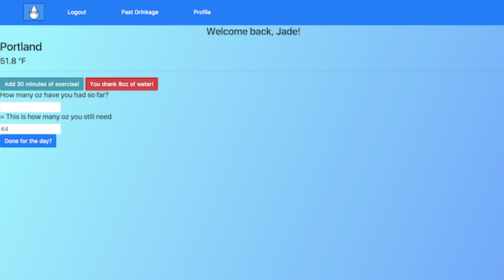
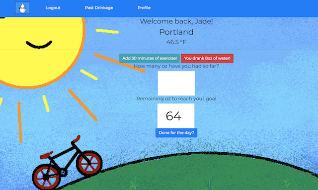
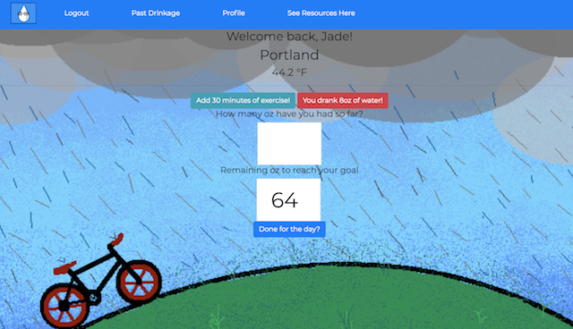
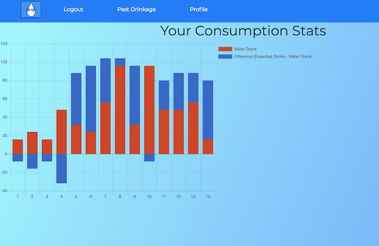

# Technical Requirements
* Have at least 2 models (more if they make sense) -- ideally a user model and one that represents the main functional idea for your app
* Include sign up/log in functionality, with hashed passwords & an authorization flow
* Incorporate at least one API. Examples include Yelp, Tumblr, Facebook, and others on Mashape.
* Have complete RESTful routes for at least one of your resources with GET, POST, PUT, and DELETE
* Utilize an ORM to create a database table structure and interact with your relationally-stored data
* Include wireframes that you designed during the planning process
* Have semantically clean HTML and CSS
* Be deployed online and accessible to the public

# Wireframes and Beginning Layout

# Route Planning
* Create 1:M relationship between user model for signup/login and stat model to display for each user
* Use Mocha to test login and signup functionality
* API call to Weather Underground in profile route
* Chart route uses Chart.js to create a graph based on daily input for logged in user
* Nav bar as partial that adapts to user login
* Resources page displaying my educational links and calculations

# Stretch Goals
* Adaptive profile backgrounds depending on weather conditions from API
* Calculate drinks based on user age, location, and exercise
* Icons that respond to location
* Animations when user clicks exercise/drank water buttons
* Ability to convert water amounts from ounces

# Strategies
* Signup submits to user table with bcrypt password hashing and passport verification
* User input affects numbers displayed on the front end 
* User input then saves to stat table upon clicking "done for the day" button
* Saving day's stat redirects to overall graph, but graph can be viewed at any time
* Graph logs both water drank and the difference between that and what was calculated for you
* Calculations include location temperature 

# Finished Layout

# Challenges 
* Working with the database logging the correct information
* Determining the most efficient place to make the call to the API
* Database associations and accessing data from both tables
* Creating a fun but professional design in the amount of time I had

# What I'd Do With More Time
* Make a sleeker and customizable profile design
* Include more factors to work into the water calculations
* Incorporate more information from the API call
* Have a "settings" element in which you can update and save your location

# What I've Learned
* More about the functionality of an ORM (I used Sequelize)
* How to balance the load on front-end and back-end work
* Time management for full-stack projects, including design
